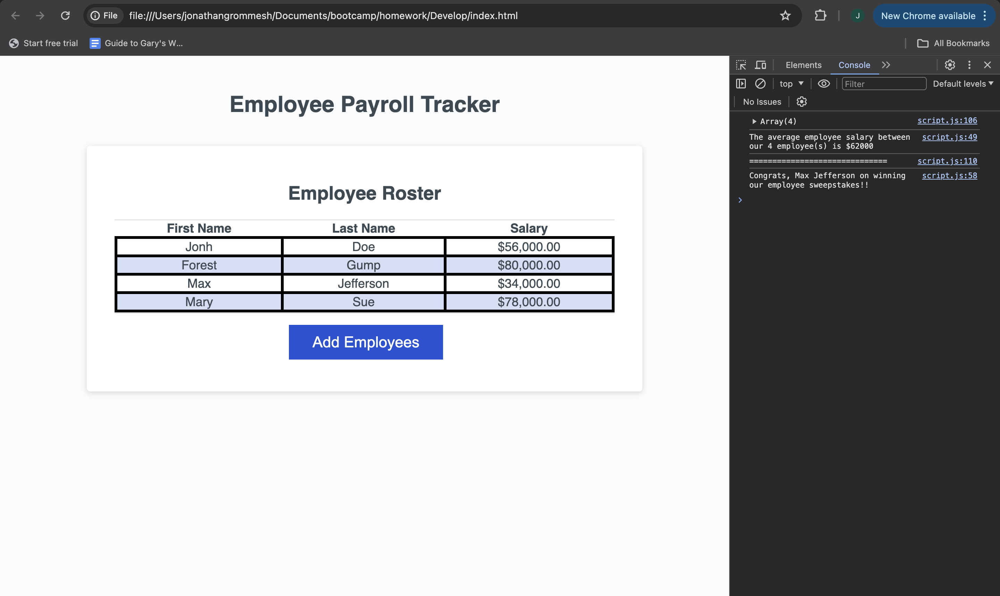

# Semantic HTML Homework

In this assignment, I built three working javascript functions and added them to existing code producing an application which tracks employee data. The user is prompted to add employees first and last names as well as their salaries, and a while loop allows them to continue adding employees as long as they choose to. The existing code produces a table of this data on the webpage. I also created a function that determines the average salary of the listed employees and another that selects an employee at random. Both functions console log their respective results utilizing template literals. 

## Link to Deployed Version
[Click here to see the deployed version](https://jongrom.github.io/jongrom's-employee-tracker/)

## Screenshot of the Deployed Version
